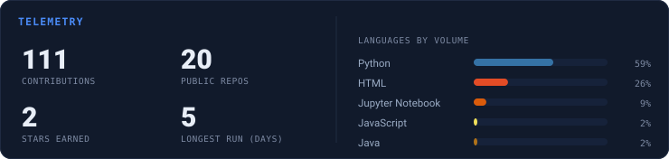

<h1 align="center">hey, i'm aryan 🚩</h1>

  <b>penetration tester</b> · founder of <a href="https://bugsnaps.in">BugSnaps</a> and <a href="https://www.myrecon.xyz">MyRecon</a> · <code>CEH</code> 
  i build tools that refuse to guess

---

## 🎧 currently listening

<!-- SPOTIFY:START -->
<!-- rewritten by .github/workflows/spotify.yml - edit the script, not this block -->

  <a href="https://open.spotify.com/track/3c7Ctlw9MKlIQPxRH3fOTt">
    <picture>
      <source media="(prefers-color-scheme: dark)" srcset="./assets/spotify-dark.svg?v=1789398554">
      <source media="(prefers-color-scheme: light)" srcset="./assets/spotify-light.svg?v=1789398554">
      
    </picture>
  </a>

<!-- SPOTIFY:END -->

straight off the Spotify Web API. it's a snapshot rather than a stream, so it
tells you when it was taken instead of pretending to be live.

---

## 🏗️ what i'm building

**[BugSnaps](https://bugsnaps.in)** — my penetration testing and offensive security
practice. Application and infrastructure testing against the OWASP methodology,
for growing businesses that need findings their developers can actually act on
rather than a PDF of raw scanner output.

**[MyRecon](https://www.myrecon.xyz)** — an OSINT platform that came out of the day
job. Username sweeps across 100+ platforms, email breach exposure, and domain,
DNS and IP investigation. On the web, on Google Play, and backed by a breach
archive that updates daily. Passwords are hashed in your browser, so they never
leave your device.

---

## 📬 need a pentest?

I take on application and infrastructure security work, plus
[footprint removal](https://www.myrecon.xyz/services.html) for people who need
their personal data off the open web.

  

Same address for a result you think is wrong — those are the most useful
messages I get. If a platform reports something MyRecon missed, or reports one
that isn't real, tell me and I'll measure it.

---

## 🔗 where to find me

  
  
  

  
  
  

---

## 🕵️ `$ whoami`

  

Mapping an organisation's attack surface and mapping a person's public
footprint are the same exercise with a different subject. You enumerate what is
reachable, verify what is real, and discard what only looks like a finding. The
third step is the one almost every OSINT tool skips.

Run a username through most tools in this category and you get a wall of green
ticks. Click a few and you find pages saying the account isn't there. That
isn't a small annoyance — it makes the whole output unusable, because if you
can't tell which results are real you have to check all of them by hand, and at
that point the tool has saved you nothing.

So MyRecon measures instead of assuming. To test whether a platform can be
checked reliably we request a handle we know is real and a string of nonsense
nobody could have registered, then compare the responses byte for byte. Several
well-known platforms return literally identical pages for both. Those get
labelled honestly or excluded — a smaller platform count that is true is worth
more than a bigger one that is partly fiction.

<table>
<tr><td><b>Role</b></td><td>Penetration tester · Founder</td><td><code>CONFIRMED</code></td></tr>
<tr><td><b>Certification</b></td><td>Certified Ethical Hacker — passed first attempt</td><td><code>CONFIRMED</code></td></tr>
<tr><td><b>Education</b></td><td>Master's degree, NMIMS Mumbai</td><td><code>CONFIRMED</code></td></tr>
<tr><td><b>Handle</b></td><td><code>4ryanwalia</code> — same on nearly every platform</td><td><code>CONFIRMED</code></td></tr>
<tr><td><b>Location</b></td><td>India · UTC+05:30</td><td><code>SELF-REPORTED</code></td></tr>
</table>

### `$ ls ~/field-kit`

### `$ ps aux | grep aryan`

| | What it is | Stack |
|---|---|---|
| **[MyRecon](https://github.com/4ryanwalia/Myrecon)** | Username sweeps across 100+ platforms, email breach exposure, domain/DNS/IP investigation. Web app, Android app, and a daily-updated breach archive. | `Kotlin` `Python` `JS` |
| **[Cryptoji / Coffin](https://github.com/4ryanwalia/Coffin)** | Hybrid-encrypted messages encoded as emoji sequences. Premium burial services for your digital secrets. | `Django` `React` |
| **[KINDA-EDR](https://github.com/4ryanwalia/KINDA-EDR)** | Endpoint detection and response, small enough to read end to end. | `Python` |
| **[Phishing Detection](https://github.com/4ryanwalia/Phishing-detection)** | Classifies a URL as phishing or legitimate from real-world features rather than a blocklist. | `Python` `Jupyter` |
| **[Photo Retrieval](https://github.com/4ryanwalia/intelligent-photo-retrieval)** | Hand it one selfie and it finds you in a folder of event photos using facial embeddings. | `Python` `Streamlit` |
| **[WhisperDesk](https://github.com/4ryanwalia/WhisperDesk)** | Role-based complaint management with genuinely anonymous submissions and live status tracking. | `Spring Boot` `JWT` `MySQL` |

---

## 📡 `$ myrecon --scan self --telemetry`

  <picture>
    <source media="(prefers-color-scheme: dark)" srcset="./assets/contributions-dark.svg">
    <source media="(prefers-color-scheme: light)" srcset="./assets/contributions-light.svg">
    
  </picture>

  <picture>
    <source media="(prefers-color-scheme: dark)" srcset="./assets/stats-dark.svg">
    <source media="(prefers-color-scheme: light)" srcset="./assets/stats-light.svg">
    
  </picture>

Both panels are rendered from GitHub's own GraphQL API by
<a href="./scripts/stats_card.py">a script in this repo</a>, not by a
third-party stats service. The usual one was returning <code>503</code> when I
checked — which is exactly the problem with hanging your profile off someone
else's free deployment.

---

## ☕ `$ sudo fund --coffee`

MyRecon is free, keyless where it can be, and has no paywall on the part that
matters. If it saved you an afternoon of manual checking — or if the breach
archive told you something you needed to know — you can put something in the
tin. It goes straight back into hosting and the next batch of platform
verification work.

  
  &nbsp;
  

<code>scan complete · 4 attributes confirmed · 1 self-reported · 0 inferred</code>

